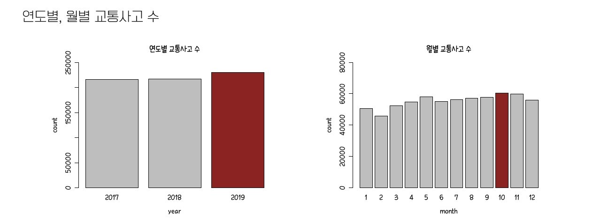
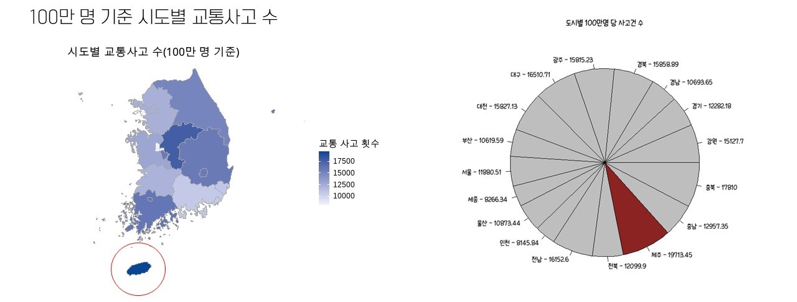
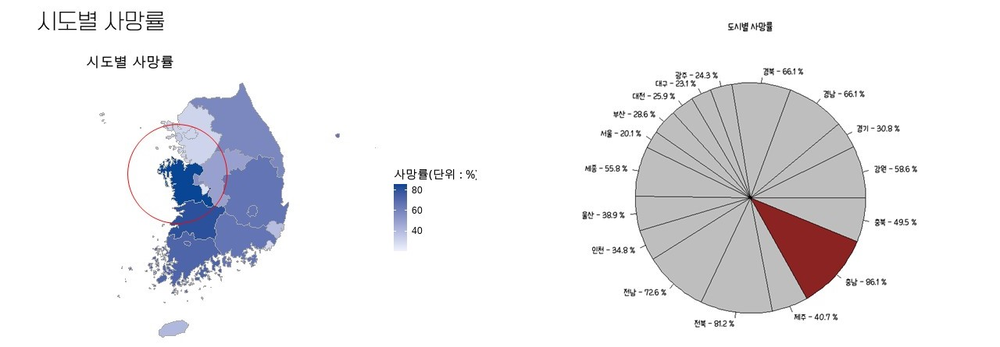
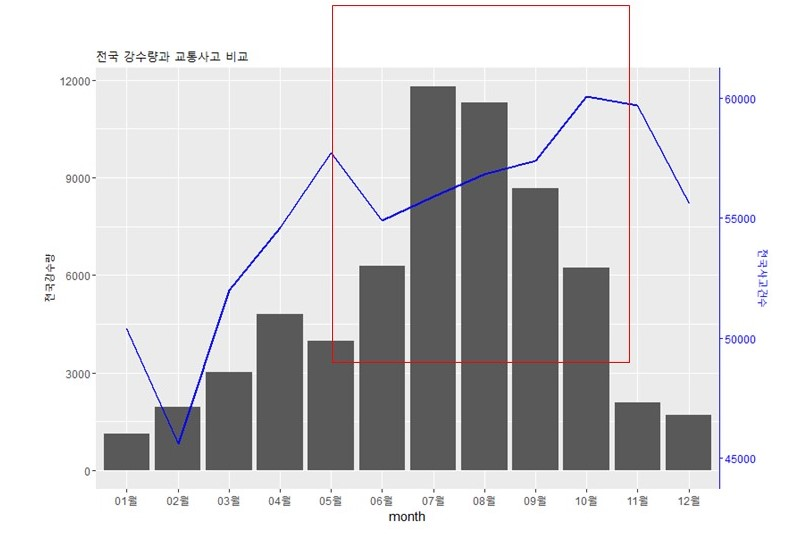
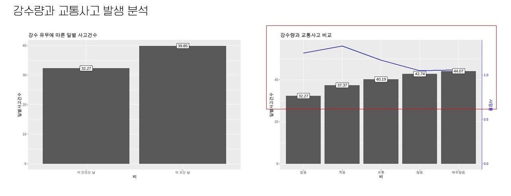
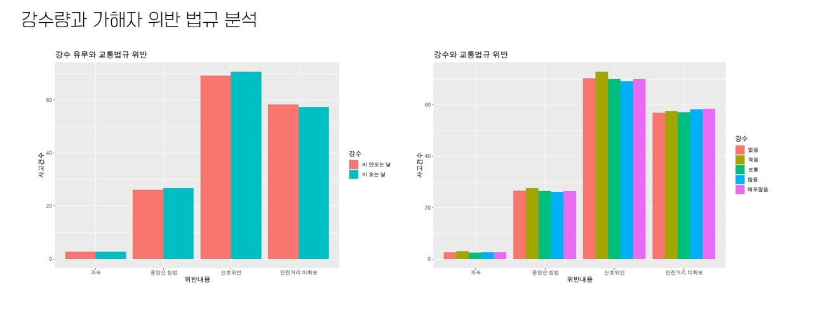

# Relation-between-weather-and-car-accident-using-R
* presentation: https://www2.slideshare.net/HyeinGu/relation-between-weather-and-accidents-in-koreausing-r
 
## 1. 기획 의도 
* 날씨 요소와 교통 사고와의 관계를 R 프로그램을 통해 분석하였다.  
* 비오는 날 또는 눈오는 날 교통사고량이 높아진다는 기사를 참고하여 실제 데이터를 비교했을 때 어떤 관계가 있는지 확인하고자 하였다.  

## 2. 사용 Tool
* R

## 3. DATA

* 교통사고 분석 시스템 통계자료: http://taas.koroad.or.kr/
  * 일별 도시별 교통사고 통계(2017.01.01 ~ 2019.12.31)
  * 일별 교통사고 발생시 위반 법규 내용 데이터
* 기상청 날씨 누리: https://www.weather.go.kr/weather/main.jsp
  * 지상관측자료 크롤링
* 국가 통계 포털: https://kosis.kr/index/index.do
  * 행정구역별 월별 인구수 데이터

## 4. 분석 결과

#### 1) 연도별 변화 추이

#### 2) 시도별 인구수 대비 교통사고 발생량 및 사망률

#### 3) 강수량과 교통사고 발생 분석

#### 4) 강수량과 교통사고 가해자 위반 법규 분석

